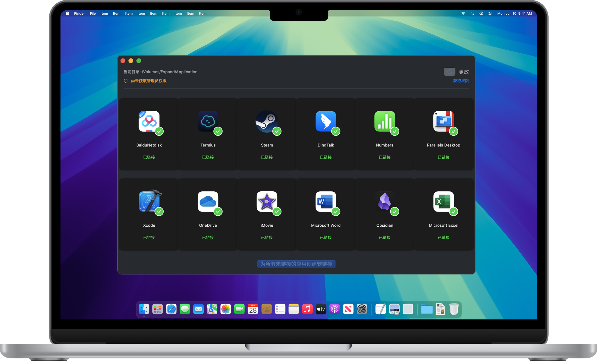

# APPsLink

APPsLink 是一个 macOS 应用程序，用于自动为外置硬盘上安装的应用程序创建软链接到本地 `/Applications` 目录。



## 功能特点

- 自动识别外置硬盘上的应用程序
- 清晰显示每个应用的链接状态
- 使用应用图标直观展示应用列表
- 支持自定义工作目录选择
- 一键为所有未链接的应用创建软链接
- 单个应用软链接创建

## 为什么使用 APPsLink？

如果你有外置硬盘存储了大量应用程序，每次使用时都需要从外置硬盘打开会很不方便。通过创建软链接，这些应用会显示在 Launchpad 中，可以像本地安装的应用一样直接启动，但实际文件仍存储在外置硬盘上，节省了主硬盘空间。

## 使用方法

1. 下载并运行 APPsLink
2. 点击"获取管理员权限"按钮，输入密码（创建软链接到 `/Applications` 需要管理员权限）
3. 点击"选择文件夹"按钮，选择包含应用程序的外置硬盘文件夹
4. 应用会显示文件夹中所有的 `.app` 文件，已有软链接的会显示绿色对勾
5. 点击未链接应用下方的"创建链接"按钮，或使用底部的"为所有未链接的应用创建软链接"按钮

## 系统要求

- macOS 15.0 或更高版本
- 管理员权限（创建软链接到 `/Applications` 目录需要）

## 安装

### 下载安装包
从 [Releases](https://github.com/yourusername/APPsLink/releases) 页面下载最新版本的 `.zip` 文件，解压后即可使用。

### 从源码构建
```bash
# 克隆仓库
git clone https://github.com/yourusername/APPsLink.git
cd APPsLink

# 使用 Xcode 打开并构建
open APPsLink.xcodeproj
```

## 贡献

欢迎提交 Pull Requests 和 Issues。您可以：
- 报告 Bug
- 提出新功能建议
- 完善文档
- 提交代码改进

## 许可证

本项目基于 Apache License 2.0 开源 - 查看 [LICENSE](LICENSE) 文件了解详情。